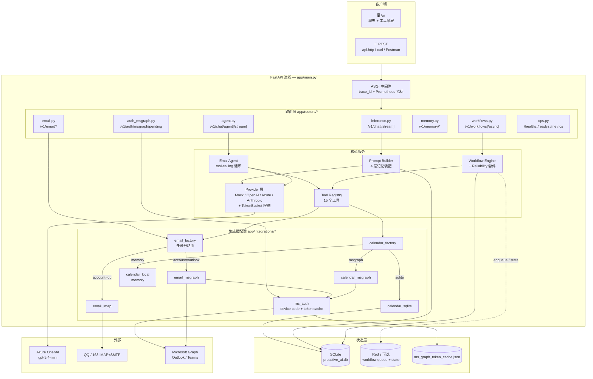
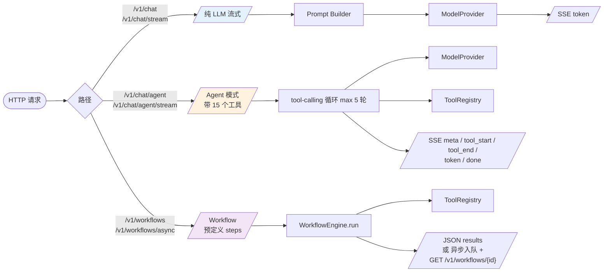
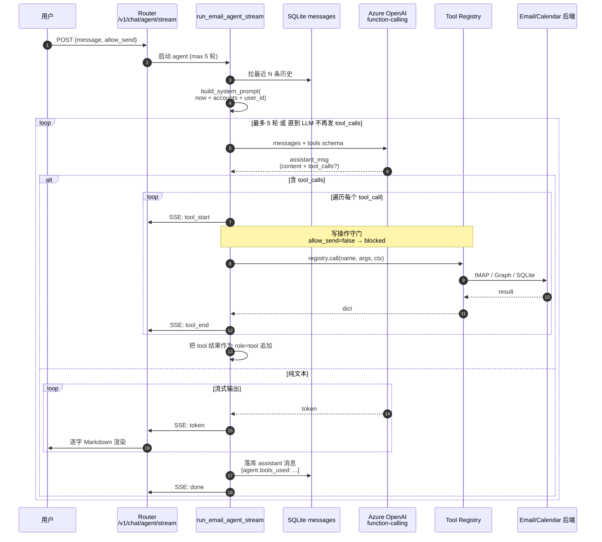
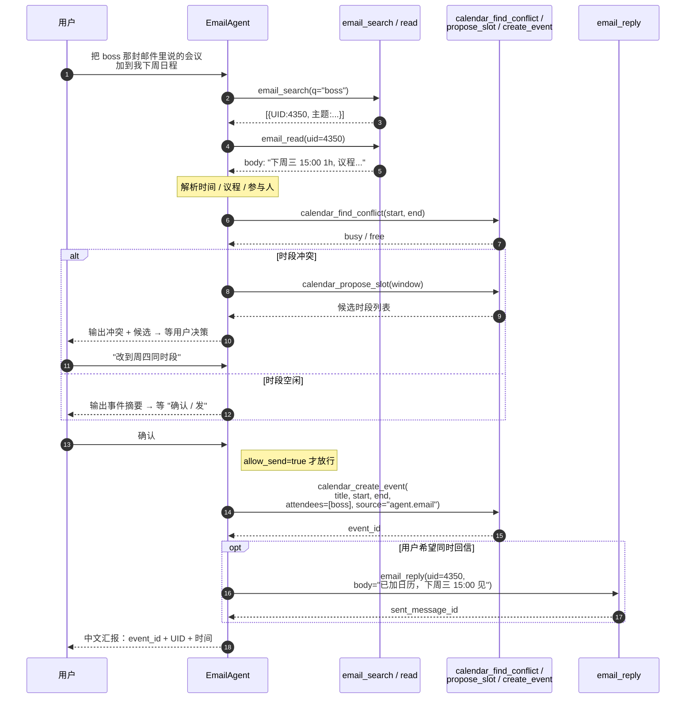
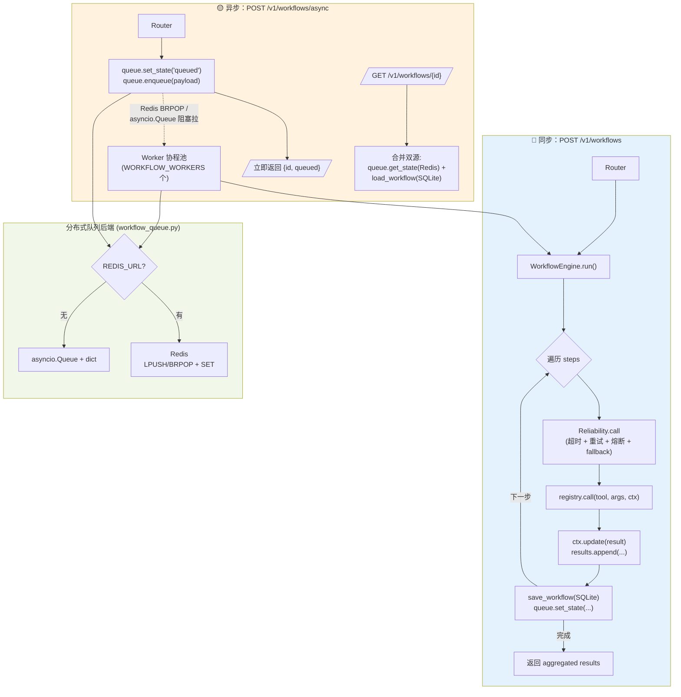
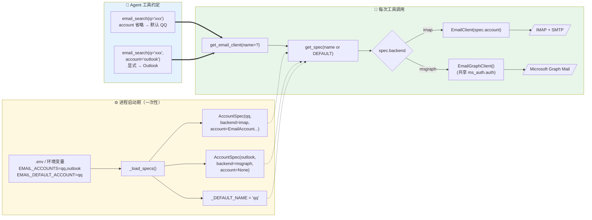
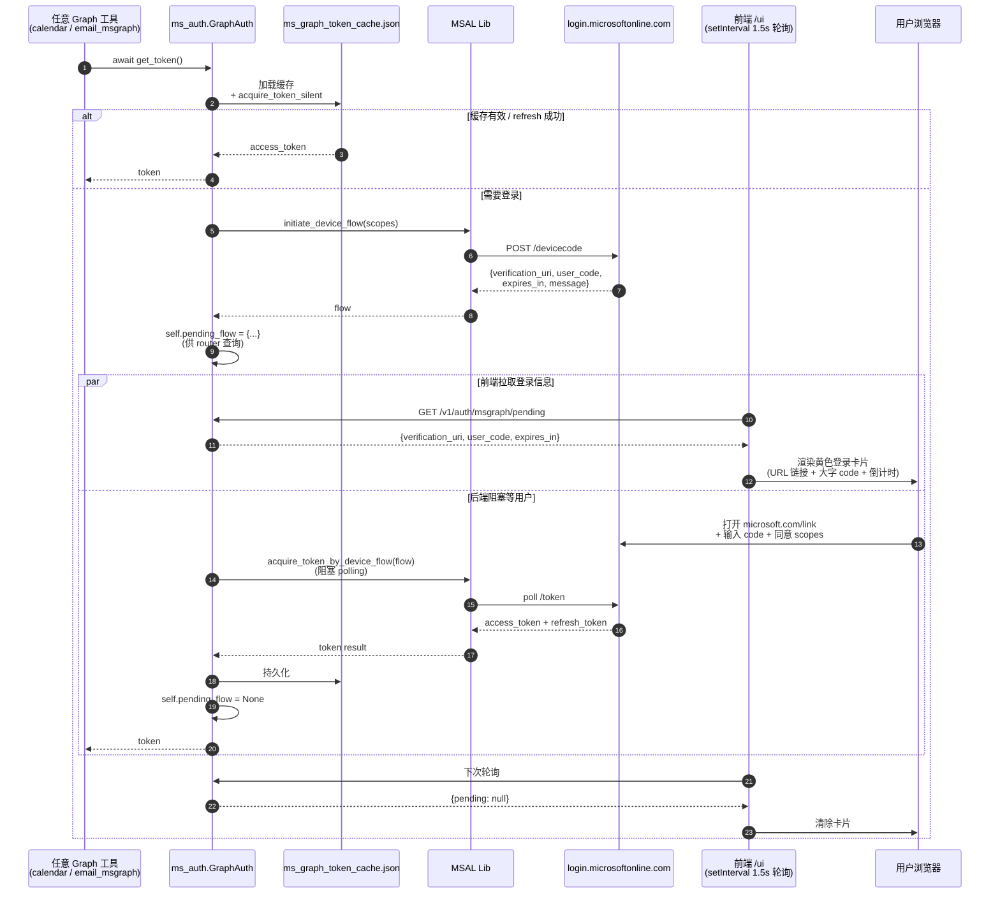
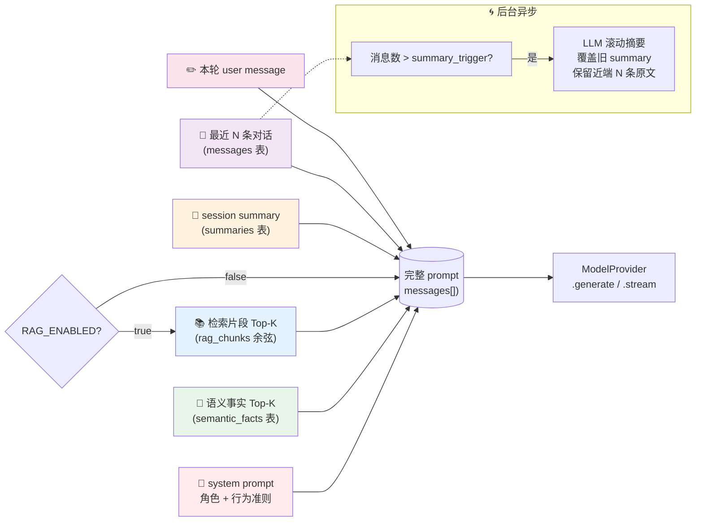

# Proactive AI Backend — Aido

> **Aido**：面向全球用户的个人 AI 助理后端。
> 短期目标：协同 **Email / Chat / Calendar** 等生产力工具，帮用户处理日常沟通与工作事务。
> 长期目标：做到 Telegram / WhatsApp / 微信 形态级别的"最强个人 AI 助理"。

一份可独立运行的参考实现，覆盖从模型 Provider、记忆体系、工作流编排，到流式 UI、可观测性、容器化部署的端到端链路。**默认无需任何 API Key 即可启动**（用本地 mock provider），配置 Azure OpenAI / OpenAI / Anthropic 环境变量后自动切到真实模型。

---

## 🧭 架构与流程图

> 全部用 Mermaid 写就，GitHub / VS Code 预览原生支持。
> 第一张是俯瞰图，看清边界与依赖；后面 7 张分别聚焦一个独立的编排子系统（Agent loop / 跨工具协同 / Workflow 调度 / 多账号 Email / OAuth 登录 / Prompt 装配）。

### 1. 整体架构（俯瞰）



---

### 2. 请求路由：三条并行通道



**记住三件事**
- `/v1/chat/stream` = 纯文本生成，**无工具**
- `/v1/chat/agent/stream` = 同样 SSE，但 LLM 可以调工具（前端默认走这条）
- `/v1/workflows` = 不靠 LLM 决策，由调用方写死 steps 数组（适合定时任务 / 后台脚本）

---

### 3. EmailAgent tool-calling 循环（核心）



**关键守门**
- `email_send / email_reply / email_forward / email_delete / calendar_create_event` 在 `allow_send=false` 时直接被 router 拦截，前端 UI 上对应红色复选框。
- 工具结果中携带 `account` 信息（多账号路由用），LLM 后续步骤复用同一账号避免 UID 串号。

---

### 4. 跨工具编排：邮件 → 日历 → 回信（杀手级特性）



---

### 5. WorkflowEngine 调度：同步与异步双轨



**核心设计**：同步与异步共用同一个 `WorkflowEngine.run`，差别仅在调度入口。一份工具代码、一份可靠性策略、一份持久化逻辑，写一次跑两种模式。

---

### 6. 多账号 Email 工厂（QQ + Outlook 共存）



**约束**：同一会话里拿到的 UID 必须在同一账号下使用——QQ 的 UID 不能拿去 Outlook 调 `read/reply/delete`。System prompt 第 11 条强制 LLM 复用同一 `account` 值。

---

### 7. Microsoft Graph 设备码登录（前端可视化）



---

### 8. Prompt 装配链路（4 层记忆）



---

## ✨ 已实现的功能（截至 2026-06）

### 1. 模型 Provider 层（可插拔 + 限速）
- 协议化的 `ModelProvider`（`generate` / `stream`）
- 内置 4 个实现：
  - **Mock**：离线开发 / 单测，零依赖
  - **OpenAI**：公共云 `gpt-*`
  - **Azure OpenAI**：与根目录 `app.py` 共用同一套环境变量（`AZURE_OPENAI_API_KEY` / `AZURE_OPENAI_ENDPOINT` / `AZURE_OPENAI_API_VERSION` / `AZURE_OPENAI_DEPLOYMENT`），`model=` 自动填 deployment
  - **Anthropic**：`claude-3.5-*` 系列
- **TokenBucket** 限速：`provider_tokens_per_minute` + `provider_burst_tokens`，保护下游配额
- **`temperature` 可选**（默认不传，**GPT-5 / o-series 直接兼容**）
- `build_provider()` 自动检测：未显式指定 `PROVIDER` 时按 Azure → OpenAI → Anthropic → Mock 顺序回落

### 2. 记忆体系（4 层 + 滚动摘要）
- **短期上下文**：`memory_window_messages` 控制注入 prompt 的最近 N 条
- **长期会话**：SQLite `messages` 表持久化全部对话
- **滚动摘要**：超过 `summary_trigger_messages` 时后台 LLM 压缩成 summary，保留 `summary_keep_recent` 条近端原文
- **语义事实/偏好**：`semantic_facts` 表，支持 `profile` / `fact` / `reminder` 三类，关键字打分检索（Top-K 注入 prompt）
- **事故事件**：`incidents` 表沉淀所有失败现场，附带 trace_id 可回放
- 统一通过 `prompt_builder.build_prompt()` 拼装：`system → semantic → summary → recent → user`

### 3. 推理链路（缓存 + 微批 + 可靠性）
- `response_cache`：LRU + TTL（`cache_ttl_seconds` / `cache_max_items`）
- `Batcher`：把 `batch_window_ms` 内的并发请求收敛到单个调度点
- `Reliability` 套件：超时 / 指数退避重试 / `CircuitBreaker` / fallback 协程
- 失败自动降级，主链路永不中断

### 4. 流式输出（SSE）
- `POST /v1/chat/stream` 标准 SSE：`event: token | done | meta`
- 中间件改写为**原生 ASGI 实现**，避免 `BaseHTTPMiddleware` 缓冲整个响应（这是真正能逐字流的关键）

### 5. 多步工作流（同步 + 分布式异步）

这是 Aido 的"编排层（Orchestration Layer）"，是连接「用户意图」与「真实工具调用」的中枢。
**职责定位**：把一个目标拆成若干工具调用 → 按顺序串行执行 → 每步进度持久化 → 任一步失败不中断整流 → 长流程可被外部查询、可被重启恢复。

#### 5.1 概念模型

```
   ┌─────────────────────────────────────────────────────────────┐
   │                       WorkflowEngine                        │
   │                                                             │
   │  goal + steps[]                                             │
   │     │                                                       │
   │     ▼                                                       │
   │  ┌───────┐  ctx  ┌───────┐  ctx  ┌────────────────┐         │
   │  │ tool1 │ ────▶ │ tool2 │ ────▶ │     tool3      │         │
   │  └───┬───┘       └───┬───┘       └────┬───────────┘         │
   │      │ Reliability   │ Reliability    │ Reliability         │
   │      ▼               ▼                ▼                     │
   │  ┌──────────┐     ┌──────────┐    ┌──────────┐              │
   │  │ results  │ + + │ results  │ ++ │ results  │              │
   │  └──────────┘     └──────────┘    └──────────┘              │
   │                          │                                  │
   │                          ▼                                  │
   │  ┌─────────────────────────────────────────────┐            │
   │  │ persist: SQLite(workflows)                  │            │
   │  │ + distributed state: Redis(or in-memory KV) │            │
   │  │ + incidents on failure                      │            │
   │  └─────────────────────────────────────────────┘            │
   └─────────────────────────────────────────────────────────────┘
```

核心三要素：
- **Step**：`{"tool": "<name>", "args": {...}}`，由 `tools.py` 中的 `ToolRegistry` 解析
- **Context**：跨 step 共享的 `dict`，每个工具返回的字段会 merge 进去给下一步用（链式编排的关键）
- **Results**：每步的结构化结果 `{step, tool, result|error|fallback}`，全程对外可见

#### 5.2 调度模式：同步 vs 异步

| 模式 | 入口 | 适用场景 | 行为 |
|---|---|---|---|
| **同步** | `POST /v1/workflows` | 短任务（数秒内完成） | HTTP 长连接等结果；客户端拿到最终聚合 |
| **异步** | `POST /v1/workflows/async` | 长任务（分钟级） | 立刻返回 `{workflow_id, status:"queued"}`，后台 worker 执行 |

二者**共用同一个 `WorkflowEngine.run`**，差别仅在调度入口（直接 await vs 入队）。这意味着同一份工具代码、同一份可靠性策略、同一份持久化逻辑，写一次跑两种模式。

#### 5.3 分布式状态后端（`workflow_queue.py`）

启动时自动探测 `REDIS_URL`：

| 后端 | 触发条件 | 队列原语 | 状态原语 |
|---|---|---|---|
| **Redis** | `REDIS_URL` 已设置 | `LPUSH` / `BRPOP`（阻塞拉取） | `SET wf:state:{id}` |
| **In-memory** | 未设置 | `asyncio.Queue` | `dict` |

切换是无感的——业务代码永远调用统一接口 `enqueue / dequeue / set_state / get_state`。
开发期零依赖，生产期改一个环境变量就具备多副本分布式能力。

#### 5.4 后台 Worker

启动时按 `WORKFLOW_WORKERS`（默认 1）起若干 asyncio 协程：

```
worker_loop:
  while True:
    task = queue.dequeue()      # 阻塞等待
    engine.run(task.user_id, task.goal, task.steps)
```

特性：
- 与 FastAPI 进程**同进程**，但完全脱离 HTTP 请求生命周期（不受客户端断开影响）
- 失败不会让 worker 退出（异常被吞掉、日志记录后继续下一个）
- 想横向扩展？多个 FastAPI 副本各自起 N 个 worker，Redis 的 BRPOP 天然支持竞争消费

#### 5.5 单步可靠性（Reliability 套件）

每个 step 都会经过 `Reliability.call(...)`，自动应用以下保护：

| 机制 | 配置 | 行为 |
|---|---|---|
| 超时 | `workflow_step_timeout_ms`（默认 10s） | `asyncio.timeout` 强制中断 |
| 重试 | `retry_max=2` | 指数退避 + 抖动 |
| 熔断 | `CircuitBreaker(threshold=5, reset=30s)` | 连续失败 5 次切 OPEN，30s 后探测 |
| 降级 | per-step `fallback` 协程 | 返回 `{fallback: true, ...}`，整流继续 |

**关键设计**：fallback 不抛异常，而是返回一个标记字段，让后续 step 仍能拿到上下文。
这保证了"一个工具暂时挂掉不会把整段流程废掉"，是长流程编排的关键韧性来源。

#### 5.6 持久化与可观测

每步执行完后**立即**写两个地方：

1. **SQLite `workflows` 表**：完整快照 `(workflow_id, user_id, goal, status, steps_json, results_json, updated_at)`
2. **分布式 KV**：`wf:state:{id} = {status, results}` —— 用于外部增量查询

任何失败都会同时写 `incidents` 表，附带 `trace_id`。结合现有的：
- 结构化日志（每行 JSON，含 `trace_id, workflow_id, step, tool`）
- Prometheus 指标（`workflow.started / completed / failed / fallback / enqueued`）
- OpenTelemetry span（每步一个 child span）

→ 一个长流程出问题时，从 Grafana / Tempo / Loki 都能反查到具体哪一步的具体输入与异常堆栈。

#### 5.7 工具注册表（`tools.py`）

工具用一个最小协议描述：

```python
ToolFn = Callable[[args: dict, ctx: dict], Awaitable[dict]]
registry.register("fetch_notes", fetch_notes)
```

- `args`：本次 step 的参数
- `ctx`：跨 step 共享上下文，包含之前所有工具返回的字段
- 返回值：dict，自动 merge 到 ctx 供下一步使用

内置 demo 工具：`fetch_notes` / `summarize` / `extract_actions` / `echo`，是把"抓笔记 → 总结 → 抽行动项"这条最常见的助理工作流跑通的最小示范。
**未来 Email / Calendar / Chat 适配器都用这同一个协议接入**——增量改造无需动 engine。

#### 5.8 一个完整请求时序

```
[Client] POST /v1/workflows/async {goal, steps:[a,b,c]}
   │
   ▼
[Router] enqueue_workflow()
   │  - 生成 workflow_id
   │  - queue.set_state(id, {queued})
   │  - queue.enqueue(payload)
   │  - return {workflow_id, "queued"}     ← 客户端立刻拿到响应
   ▼
[Worker]  task = queue.dequeue()           ← BRPOP 取走任务
   │
   ▼
[Engine] engine.run(user_id, goal, steps)
   │
   │  loop step in steps:
   │     ├─ tool = registry.get(step.tool)
   │     ├─ result = Reliability.call(lambda: tool(args, ctx), fallback)
   │     │     ├─ timeout 8s
   │     │     ├─ retry 2x
   │     │     └─ CircuitBreaker
   │     ├─ ctx.update(result); results.append({step,tool,result})
   │     ├─ save_workflow(...)             ← SQLite 增量更新
   │     └─ queue.set_state(id, {running, results})  ← Redis 增量更新
   │
   ▼
[Engine] finalize → status=completed/failed
[Client] GET /v1/workflows/{id}            ← 随时拉到当前进度（state + record 双源）
```

#### 5.9 与未来 LangGraph 的关系

当前 engine 是**线性 DAG**（step[i].ctx → step[i+1]），适合"流水线式"任务（抓→总结→抽取）。
未来会演进为 **LangGraph StateGraph**，加上：
- 条件路由（按意图分发到 EmailAgent / CalendarAgent / ChatAgent）
- 回路（ReAct：tool → reason → tool）
- Human-in-the-loop（敏感操作前 `interrupt_before`）
- Checkpointing（SqliteSaver 复用本表，长流程可恢复）

**编排层会保留 Redis 队列做任务级分布式调度，LangGraph 在每个任务内部做节点级调度，两层分工。** 详见下文「LangGraph 怎么用进 Aido」。

### 6. Prometheus 指标
- 用 `prometheus_client` 暴露真正的 exposition 文本：
  - `http_requests_total{method,path,status}`
  - `http_request_duration_seconds`（直方图）
  - `inference_requests_total{kind}`
  - **Agent 层**：`agent_tool_calls_total{tool,status}` / `agent_tool_duration_seconds{tool}` / `agent_iterations`
  - **Workflow 层**：`workflow_runs_total{status}` / `workflow_step_duration_seconds{tool,status}` / `workflow_queue_depth`
  - **Reliability**：`reliability_calls_total{name,outcome}` / `reliability_call_attempts{name}` / `circuit_breaker_state{name}`
  - 旧 `metrics.inc/observe/set_gauge` 调用通过 facade 兼容
- `GET /metrics` 直接对接 Prometheus 抓取

### 7. OpenTelemetry 链路追踪
- `app/tracing.py`：检测到 `OTLP_ENDPOINT` 自动启用
- 自动 instrument FastAPI + httpx，跨服务 W3C TraceContext 串联
- 未配置时静默跳过，不影响本地启动

### 8. 结构化日志 + Trace 透传
- JSON 格式输出（`logging_setup.py`）
- `x-trace-id` 入站 / 生成 / 写 contextvar / 回写响应头，全链路可追溯

### 8.5 一键可观测套件（Grafana + Prometheus + Loki + Tempo）

`observability/` 目录下是一套**开箱即用的 docker-compose 栈**，跟应用进程解耦，本地一行起、生产可平移。

```powershell
cd proactive_ai_backend\observability
docker compose -f docker-compose.observability.yml up -d
```

| 组件 | 端口 | 默认账号 | 用途 |
|---|---|---|---|
| Prometheus | http://localhost:9090 | — | 指标抓取 + 告警评估，5s 抓 `host.docker.internal:8100/metrics` |
| Grafana | http://localhost:3000 | admin / admin | 仪表盘（自动 provisioning） |
| Loki | http://localhost:3100 | — | 日志聚合，promtail 扫 `proactive_ai_backend/logs/*.log` |
| Tempo | OTLP gRPC 4317 / HTTP 4318 | — | 分布式 trace，与 Loki 通过 `trace_id` 双向跳转 |

**预置 3 张仪表盘**（自动加载，无需手动 import）：
- **Inference SLO**：QPS / 状态码混合 / p50-p95-p99 延迟 / 缓存命中 / fallback 计数
- **Agent Behavior**：工具调用速率 / 成功率 / p95 延迟 / 失败 & 阻断分布 / 迭代次数分布
- **Workflow Reliability**：运行状态分布 / 失败比例 / 队列积压 / 单步 p95 / 熔断器状态

**预置 6 条告警规则**（`observability/alerts.yml`，Prometheus 自动加载）：
| 分组 | 告警 | 条件 |
|---|---|---|
| api.slo | HighP99HttpLatency | http p99 > 2s 持续 5m |
| api.slo | HttpErrorRateHigh | 5xx 比例 > 5% 持续 5m |
| agent.reliability | AgentToolErrorRateHigh | 工具失败率 > 10% 持续 10m |
| agent.reliability | CircuitBreakerOpen | 任一熔断器持续 OPEN > 2m |
| workflow | WorkflowFailureRateHigh | 工作流失败率 > 10% 持续 10m |
| workflow | WorkflowQueueBacklog | 队列堆积 > 50 持续 5m |

**事故事件查询 API**：
```
GET /v1/incidents?limit=50&kind=workflow_step_failed&since=2026-06-01T00:00:00Z
GET /v1/incidents/summary?since=2026-06-01T00:00:00Z   # 按 kind 聚合计数
```

落库表 `incidents`，每条记录包含 `id / trace_id / kind / payload / created_at`，结合 Tempo trace_id 可一键跳到完整调用链。

### 9. 前端 UI（Telegram / WhatsApp 风格）
- 路径：`GET /ui`，无需额外构建
- **左侧栏**
  - 品牌 + "＋ 新对话" 按钮
  - **快捷协同**：📧 邮件助手 / 💬 群聊总结 / 📅 日程编排 / ✅ 抽取行动项
  - 最近会话列表（标题 + 末条预览 + 删除）
  - `user_id` 输入框
- **主区**
  - 气泡式对话（用户右、Aido 左）
  - "⚪⚪⚪ 思考中" 占位 → 首 token 到达切换为正文气泡 → 逐字 Markdown 渲染（`marked` + `DOMPurify`）
  - 自适应高度 composer，Enter 发送 / Shift+Enter 换行
- **右侧抽屉**（⚙ 工具）：工作流 / 记忆 / 运维 三类 ops
- 所有会话历史 `localStorage` 本地化，刷新不丢
- 响应式：手机视图自动隐藏侧栏
- 深 / 浅色随系统切换

### 10. 持久化（SQLite + aiosqlite）
| 表 | 用途 |
|---|---|
| `messages` | 对话历史 |
| `summaries` | 滚动摘要 |
| `semantic_facts` | 语义事实 / 偏好 / 提醒 |
| `workflows` | 工作流目标 + 步骤 + 结果快照 |
| `incidents` | 失败事件（含 trace_id） |

### 11. 测试 & API 集成
- `tests/`：
  - `test_pipeline.py` / `test_reliability.py` / `test_workflow.py`（`pytest-asyncio` auto 模式）
  - **`test_scenario_email_to_calendar.py`** —— 端到端场景测试，**不打外部依赖即可验证**"把昨天 Boss 那封邮件里提的会议加到我下周日程，并回复确认"这条完整链路：`email_search → email_read → calendar_find_conflict → calendar_create_event → email_reply`，包含 allow_send 守门、冲突检测共 3 个用例
- `api.http`：VS Code REST Client 一键测试所有端点
- `/docs`（Swagger）/ `/redoc`

跑测试：
```powershell
cd proactive_ai_backend
..\.venv\Scripts\python.exe -m pytest -v
```

### 12. 部署制品
- `Dockerfile`：`python:3.12-slim`，暴露 8100，HEALTHCHECK 已修
- `k8s/deployment.yaml` + `k8s/service.yaml`：含资源限制、就绪 / 存活探针、配置注入示例

### 13. 真实邮件接入（IMAP + SMTP）

Aido 第一个落地的协同工具适配器。**纯标准协议实现**，账号类型与厂商无关——只要给一组 IMAP/SMTP 凭据就能用，QQ / 163 / 126 / Gmail / Outlook / 自建邮箱通杀。

#### 13.1 账号配置

两种方式任选其一：

**A. 环境变量**
```powershell
$env:EMAIL_PROVIDER  = "qq"            # 预设：qq / 163 / 126 / gmail / outlook，自动填 host/port/ssl
$env:EMAIL_ADDRESS   = "you@qq.com"
$env:EMAIL_PASSWORD  = "<授权码 / app password>"   # ⚠️ QQ/163 不能用登录密码，必须开 IMAP 拿授权码
```

**B. `.env` 文件**
在 `proactive_ai_backend/.env` 写同样的键，启动时自动加载（gitignored）。

> 自定义 host/port：设 `EMAIL_IMAP_HOST` / `EMAIL_IMAP_PORT` / `EMAIL_IMAP_SSL` / `EMAIL_SMTP_HOST` / `EMAIL_SMTP_PORT` / `EMAIL_SMTP_SSL`。

#### 13.2 REST API（16 个端点，CRUD 全闭环）

| Method | Path | 用途 |
|---|---|---|
| GET | `/v1/email/account` | 账号状态 + 可用 presets（隐去密码） |
| GET | `/v1/email/folders` | 列出所有邮件文件夹 |
| GET | `/v1/email/inbox?limit=&mailbox=` | 列收件箱头部 N 封 |
| GET | `/v1/email/messages/{uid}?mailbox=` | 读一封完整邮件（含正文） |
| GET | `/v1/email/messages/{uid}/view?mailbox=` | **邮件 permalink**：独立 HTML 页面，HTML 邮件 iframe 渲染、纯文本邮件自动 linkify，标题旁有"网页版打开收件箱"按钮 |
| GET | `/v1/email/search?q=&limit=&mailbox=` | 关键字搜索（ASCII 走 IMAP SEARCH，中文本地过滤） |
| POST | `/v1/email/send` | 发邮件（支持 cc / html / attachments） |
| GET | `/v1/email/messages/{uid}/attachments` | 附件列表（名称/MIME/大小/part_id） |
| GET | `/v1/email/messages/{uid}/attachments/{part_id}` | **附件二进制下载**（RFC 5987 中文文件名兼容） |
| POST | `/v1/email/messages/{uid}/reply` | 回复（自动 In-Reply-To/References/Re:/引文，可 reply_all） |
| POST | `/v1/email/messages/{uid}/forward` | 转发（自动 Fwd:/引文，支持 attachments） |
| PATCH | `/v1/email/messages/{uid}/seen` | 标已读 / 未读 |
| PATCH | `/v1/email/messages/{uid}/flag` | 加 / 去星标 |
| PATCH | `/v1/email/messages/{uid}/flags` | 通用 IMAP flags 增删（add/remove 任意 \Seen \Flagged \Answered \Draft 等） |
| POST | `/v1/email/messages/{uid}/move` | 移动到指定文件夹 |
| DELETE | `/v1/email/messages/{uid}?hard=&mailbox=` | 软删（移 Trash）/ 硬删（EXPUNGE 不可恢复） |

#### 13.3 QQ / 163 兼容性细节

这些是踩过的坑，写在代码里也写在这：

- **必须在 LOGIN 后立刻发 IMAP `ID` 命令**，否则 QQ / 163 返回 `Unsafe Login. Please contact ...` 让 INBOX 一片空白
- **`SEARCH CHARSET UTF-8` 在 QQ 上直接报错**：ASCII 关键字走原生 SEARCH，中文关键字只能本地过滤最近 200 封 header
- **软删要走 MOVE → 找不到 Trash 就 COPY+EXPUNGE 回退**；Trash 文件夹名候选：`Deleted Messages` / `Trash` / `已删除` / `&XfJSIJZkkK5O-`
- **HTML 邮件保留原文** + 同时生成纯文本版（给 LLM 看）：permalink 页面用 `<iframe srcdoc>` 隔离样式，正文里的真实超链接照样能点

### 14. EmailAgent（真正会动手的助手）

把 chat + 邮件工具串起来的 **tool-calling 循环**。用户用大白话发指令，agent 自己决定调哪几个工具、几次循环、最后用中文汇报。

#### 14.1 为什么不用 LangGraph？

邮件流程实际深度 ≤ 3 步（搜→读→回复 / 搜→标记），用 LangGraph 反而是杀鸡用牛刀。所以这里**手写了一个最小 tool-calling loop**（`run_email_agent`，max 5 轮），300 行不到，行为可控、调试直观。

未来 Email + Calendar + Chat 协同时（深度 > 5 步、需要分支 / 回路 / 中断），再升级到 LangGraph。

#### 14.2 入口

```
POST /v1/chat/agent
{
  "user_id": "u1",
  "session_id": "s1",
  "message": "帮我看看今天 GitHub 发的邮件，标已读",
  "allow_send": false,    // 守门：false 时 email_send / email_reply / email_forward / email_delete 全部被拒
  "max_tokens": 1024,     // 可选，默认 1024
  "history_limit": 12     // 可选，默认 12，注入到 agent 的最近会话条数
}
```

响应：
```json
{
  "trace_id": "...",
  "text": "...中文汇报...",
  "iterations": 2,
  "actions": [
    {"name": "email_search",     "args": {...}, "result": {...}, "error": null},
    {"name": "email_mark_seen",  "args": {...}, "result": {...}, "error": null}
  ]
}
```

另有 **`POST /v1/chat/agent/stream`** 同入参，走 SSE 流式返回 `meta / tool_start / tool_end / tool_blocked / token / done / error / end` 事件，前端 `/ui` 默认走这条。

会话历史自动写进 `messages` 表（assistant 消息尾部附 `[agent.tools_used: ...]` 便于审计）。

#### 14.3 注册的 15 个工具

**📧 Email（11 个）**
- 读：`email.list_inbox` · `email.search` · `email.read` · `email.list_attachments`
- 写：`email.send` · `email.reply` · `email.forward` · `email.mark_seen` · `email.mark_flag` · `email.move` · `email.delete`

**📅 Calendar（4 个，**三后端可切换** — 环境变量 `CALENDAR_BACKEND` 决定）**
- 读：`calendar.list_events` · `calendar.find_conflict` · `calendar.propose_slot`
- 写：`calendar.create_event`（可传 `online_meeting=true` 生成 Teams 会议链接，仅 msgraph + 工作/学校账号有效）

| `CALENDAR_BACKEND` | 实现文件 | 持久化 | 跨设备同步 | 适用 |
|---|---|---|---|---|
| `memory` | [calendar_local.py](app/integrations/calendar_local.py) | ❌ | ❌ | 单测 / 部分场景 |
| `sqlite` *(默认)* | [calendar_sqlite.py](app/integrations/calendar_sqlite.py) | ✅ `proactive_ai.db` | ❌ | 单机本地项目 |
| `msgraph` | [calendar_msgraph.py](app/integrations/calendar_msgraph.py) | ✅ Outlook 云 | ✅ 手机/桌面/Web | 工作实际使用 |

> 三者**接口完全同构**，通过 [calendar_factory.py](app/integrations/calendar_factory.py) 进行运行期选择；Agent / Workflow 代码**一行不动**。
> 切换到 msgraph 需要设置 `MS_GRAPH_CLIENT_ID` + `MS_GRAPH_TENANT_ID`（详见 §15）。

同时注册到：
- `ToolRegistry`（让普通 workflow 也能调）
- EmailAgent 的 OpenAI tools schema（function-calling 格式）

#### 14.4 行为准则（agent system prompt 关键约束）

按优先级从高到低，详见 `app/agent/email_agent.py`：

0. **UID 是唯一身份证**：列邮件必须显式写 `[UID xxxx]`；用户说"第3封"必须按列表里的 UID 去 read，不准凭记忆推算
1. **看上下文不重复调**：tool result 里已有的字段直接用
2. **全文优先**：用户说"详情/全文"时把 `body` 字段原样贴出，不做摘要
3. **默认范围**：没说数量默认 `limit=10`
4. **不要道歉乱重查**：发现不一致先怀疑 UID 选错，问用户而不是重新搜
5. **写操作守门**：send / delete 先输出摘要 + 等"确认 / OK"再调
6. **汇报简洁不堆 JSON**，但邮件正文 / 链接原样保留
7. **多步连环**："把昨天 GitHub 的邮件都标已读"会自动 search → 循环 mark_seen
8. **地址校验**：收件人不完整就问，不瞎补
9. **邮件 permalink**：每条邮件后面附 `http://localhost:8100/v1/email/messages/<UID>/view?mailbox=<MAILBOX>`，点开即在新标签查看完整渲染（HTML 邮件含原始正文超链接，纯文本邮件自动 linkify）
10. **跨工具编排**：碰到"把 XX 邮件里说的会议加到日程"这类指令，**自动按 email_search → email_read → calendar_find_conflict → calendar_create_event → email_reply 串起来**，每一步的结果用作下一步的输入。`calendar_create_event` 与 email 写动作一样，受 `allow_send` 守门

#### 14.5 前端联动（`/ui`）

- **📧 邮件抽屉**：刷新收件箱 / 单封详情 / 7 个 CRUD 按钮（标已读 · 标未读 · 加星 · 去星 · 移动到 · 删除 · 彻底删除），删除前 `confirm()`，移动前 `prompt()` 目标文件夹
- **🤖 Agent 模式**：composer 上面的勾选框开关；旁边红色"允许真发送"对应 `allow_send`
- **执行日志卡片**：每次 agent 回复下面灰色小卡列出 `tools_used` 摘要
- **链接增强**：`renderMd` 给所有 `<a href="http*">` 强制 `target="_blank"` + 在链接旁追加"复制"按钮，一键复制 URL

### 15. 接入真实日历（Microsoft Graph / Outlook / Teams）

Calendar 后端默认是 SQLite（本地持久化），但事件**只在 Aido 内部可见**。要让 Outlook 客户端 / 手机 Teams app / 网页版 outlook.com **都能看到并同步**事件，切到 `msgraph` 后端。

#### 15.1 一次性 AAD 注册（5 分钟）

1. 用**个人 Microsoft 账号**或**工作 / 学校账号**登 <https://entra.microsoft.com>
   - ⚠ 微软员工不要用 `@microsoft.com` 生产 tenant（合规风险），改用 [M365 Developer Program](https://developer.microsoft.com/en-us/microsoft-365/dev-program) sandbox tenant
2. **Applications → App registrations → + New registration**
   - Name: `Aido-Personal`
   - Account types: 按账号类型选最匹配的（个人 → "Personal Microsoft accounts only"；工作 → "single tenant"）
   - Redirect URI: 留空
3. **Authentication → Add a platform → Mobile and desktop applications** → 勾选 `https://login.microsoftonline.com/common/oauth2/nativeclient` → **Advanced settings → "Allow public client flows" = Yes** → Save
4. **API permissions → Add → Microsoft Graph → Delegated** → 勾选：
   - `Calendars.ReadWrite`（必需）
   - `User.Read`（必需）
   - `OnlineMeetings.ReadWrite`（可选，仅工作/学校账号 + Teams license 有效，用于自动生成会议链接）
   - `offline_access`（MSAL 会自动加，不用手动）
5. Overview 页拷贝 **Application (client) ID** 和 **Directory (tenant) ID**

#### 15.2 配置环境变量

```powershell
$env:CALENDAR_BACKEND       = "msgraph"
$env:MS_GRAPH_CLIENT_ID     = "<step 1.5 拿到的 client id>"
$env:MS_GRAPH_TENANT_ID     = "<tenant id；个人账号填 consumers；混合填 common>"
$env:MS_GRAPH_SCOPES        = "Calendars.ReadWrite User.Read"   # 可选，默认值
```

#### 15.3 首次运行 → device code 登录

启动后第一次调用任意 calendar 工具时，控制台会打印：

```
======================================================================
[MS Graph] First-time login required.
To sign in, use a web browser to open the page https://microsoft.com/devicelogin
and enter the code XXXXXXXXX to authenticate.
======================================================================
```

照做：浏览器打开链接、输入 code、用你 step 1 配的账号登录、同意 4 个 scope。**之后 token + refresh_token 落 `ms_graph_token_cache.json`**，再启动不会再弹。

#### 15.4 关键细节

| 情况 | 行为 |
|---|---|
| 个人 Microsoft 账号 | ✅ Outlook 日历完全可用，❌ Teams 在线会议链接（API 限制） |
| 工作 / 学校账号 | ✅ 全功能，含 Teams 会议 |
| `online_meeting=true` + 不支持账号 | Graph 直接 400；agent 看到 error 会汇报"账号不支持 Teams 在线会议" |
| `_clear()` | 默认**拒绝执行**（保护真实 Outlook 数据），必须显式 `user_id="__force__"` |
| Token 过期 | MSAL 自动用 refresh_token 续；refresh_token 失效（默认 90 天）→ 重走 device code |
| 删 `ms_graph_token_cache.json` | 强制重登 |

#### 15.5 验证持久化

```powershell
# 1. 配好上面的环境变量后启动
..\.venv\Scripts\python.exe -m uvicorn app.main:app --port 8100 --reload
# 2. UI 里 Agent 模式 + 允许真发送，说："建一个明天 10 点的 30 分钟会议"
# 3. 完成 device code 登录
# 4. 打开 https://outlook.live.com/calendar/  → 真的能看到事件 ✅
# 5. Ctrl+C 杀掉 uvicorn 再启 → 在 UI 里问"列我的日程" → 事件还在 ✅
```

---

### 16. RAG（个人邮件检索增强对话）

把邮件正文向量化存进 SQLite，问答时按用户 query 做余弦检索，把 top-K 命中拼进 prompt 的 `retrieved_context:` 段。**默认关闭**（`rag_enabled=False`）—— 老链路、老测试零影响。

#### 16.1 架构

| 模块 | 作用 |
|---|---|
| `app/rag/embeddings.py` | `Embedder` 协议 + `MockEmbedder`（256-d，零依赖确定性，用于单测）/ `OpenAI` / `AzureOpenAI`（自动按 env 回落） |
| `app/rag/chunker.py` | 邮件感知分块：剥引用块（`>` / "On … wrote:"）、剥签名（`-- ` / "发自我的 iPhone"），按段落切，相邻 chunk overlap |
| `app/rag/store.py` | SQLite `rag_chunks` 表 + numpy 内存余弦；< 10K chunks 50ms 内完成；维度不一致行自动跳过 |
| `app/rag/service.py` | `ingest_email` / `ingest_text` / `search` / `format_as_context` 一站式编排 |
| `app/routers/rag.py` | REST：`POST /v1/rag/ingest/email`、`/ingest/text`、`/search`、`GET /stats`、`DELETE /source` & `/user/{user_id}`（GDPR） |
| `app/prompt_builder.py` | 当 `rag_enabled=True` 时，在 `semantic_memory` 之后、`session_summary` 之前注入 `retrieved_context:` 段（单次失败仅 warning，不阻断主流程） |

#### 16.2 数据表

```sql
CREATE TABLE rag_chunks (
    id INTEGER PRIMARY KEY AUTOINCREMENT,
    user_id TEXT NOT NULL,
    source_type TEXT NOT NULL,        -- 'email' | 'note' | 'chat' | ...
    source_id TEXT NOT NULL,          -- email uid / note path / chat msg id
    chunk_seq INTEGER NOT NULL,
    text TEXT NOT NULL,
    metadata_json TEXT NOT NULL DEFAULT '{}',
    embedding BLOB NOT NULL,          -- np.float32 raw bytes（已归一化）
    dim INTEGER NOT NULL,             -- 防混入不同 embedder 的脏数据
    embedder TEXT NOT NULL,           -- 'mock' / 'azure:text-embedding-3-small' / ...
    created_at TIMESTAMP DEFAULT CURRENT_TIMESTAMP,
    UNIQUE(user_id, source_type, source_id, chunk_seq)
);
```

#### 16.3 配置

```bash
RAG_ENABLED=true                      # 默认 false
RAG_TOP_K=5                           # prompt 注入的 chunk 数
RAG_EMBEDDER=                         # 空=自动；可填 mock / openai / azure
RAG_EMBEDDING_MODEL=text-embedding-3-small   # Azure 上是 deployment 名
RAG_CHUNK_CHARS=800                   # 单 chunk 目标字符数
RAG_CHUNK_OVERLAP=100                 # 相邻 chunk 字符重叠
```

> Azure 部署一个 `text-embedding-3-small` 的 deployment，复用 `AZURE_OPENAI_*` 环境变量即可，**不需要新 key**。

#### 16.4 端到端 demo

```powershell
# 1. 启动
..\.venv\Scripts\python.exe -m uvicorn app.main:app --port 8100 --reload

# 2. 批量 ingest（也可写脚本拉 IMAP inbox 喂进来）
curl -X POST http://localhost:8100/v1/rag/ingest/email -H "Content-Type: application/json" -d '{
  "user_id": "me",
  "emails": [
    {"uid":"e1","subject":"周会通知","from":"boss@x","date":"2024-09-01","body":"本周三下午 3 点开周会，地点会议室 A。"},
    {"uid":"e2","subject":"Falcon 启动","from":"pm@x","date":"2024-09-03","body":"Falcon 项目第一阶段 deadline 9 月 30 日。"}
  ]
}'

# 3. 直接搜索（调试用）
curl -X POST http://localhost:8100/v1/rag/search -H "Content-Type: application/json" -d '{
  "user_id": "me", "query": "Falcon deadline", "top_k": 3
}'

# 4. 打开 rag_enabled 后正常对话，prompt 会自动带上 retrieved_context:
$env:RAG_ENABLED="true"
# 在 /ui 里问"Falcon 啥时候交"，会基于检索到的邮件回答
```

#### 16.5 升级路径

- **向量库换 sqlite-vec / Qdrant**：只动 `store.py`，service / chunker / router 不变。
- **加 reranker**：在 `service.search` 返回前插一层 cross-encoder 重排。
- **自动 ingest 收件箱**：在 `email.read` 工具成功路径里 hook 一个 `ingest_email`；或起 worker 周期拉 inbox。
- **PII 脱敏**：在 chunker 之后、embed 之前加一层正则/NER 脱敏（手机号 / 邮箱 / 身份证）。

---

## 🌐 API 一览

| Method | Path | 用途 |
|---|---|---|
| GET | `/healthz` | 存活探针 |
| GET | `/readyz` | 就绪探针（含 provider 与 cache size） |
| GET | `/metrics` | Prometheus 文本指标 |
| GET | `/ui` | Aido 前端控制台 |
| POST | `/v1/chat` | 单次对话 |
| POST | `/v1/chat/stream` | 流式对话（SSE） |
| POST | `/v1/chat/agent` | **EmailAgent 入口**（tool-calling，`allow_send` 单一开关守门 send/reply/forward/delete） |
| POST | `/v1/chat/agent/stream` | **EmailAgent 流式入口**（SSE，前端 `/ui` 默认走这条，事件含 `tool_start / tool_end / token`） |
| POST | `/v1/memory/facts` | 写入语义事实 |
| GET | `/v1/memory/facts` | 列出用户事实 |
| GET | `/v1/memory/facts/search` | 关键字检索 |
| GET | `/v1/memory/summaries/{session_id}` | 查看滚动摘要 |
| GET | `/v1/workflows/tools` | 列出可用工具 |
| POST | `/v1/workflows` | 同步执行 |
| POST | `/v1/workflows/async` | 异步入队 |
| GET | `/v1/workflows/{id}` | 查询状态 |
| GET | `/v1/incidents` | **事故事件列表**（支持 `limit` / `kind` / `since` 过滤） |
| GET | `/v1/incidents/summary` | **事故按 kind 聚合计数** |
| GET | `/v1/email/account` | 邮件账号状态 |
| GET | `/v1/email/folders` | 列文件夹 |
| GET | `/v1/email/inbox` | 收件箱头部 |
| GET | `/v1/email/messages/{uid}` | 读全文（JSON） |
| GET | `/v1/email/messages/{uid}/view` | **邮件 permalink（独立 HTML 页）** |
| GET | `/v1/email/search` | 关键字搜索 |
| POST | `/v1/email/send` | 发邮件 |
| GET | `/v1/email/messages/{uid}/attachments` | 列附件元数据 |
| GET | `/v1/email/messages/{uid}/attachments/{part_id}` | 二进制下载附件 |
| POST | `/v1/email/messages/{uid}/reply` | 回复（自动 In-Reply-To / Re: / 引文，可 reply_all） |
| POST | `/v1/email/messages/{uid}/forward` | 转发（自动 Fwd: / 引文） |
| PATCH | `/v1/email/messages/{uid}/seen` | 标已读/未读 |
| PATCH | `/v1/email/messages/{uid}/flag` | 加/去星标 |
| PATCH | `/v1/email/messages/{uid}/flags` | 通用 IMAP flags 增删 |
| POST | `/v1/email/messages/{uid}/move` | 移动文件夹 |
| DELETE | `/v1/email/messages/{uid}` | 软删 / 硬删 |
| POST | `/v1/rag/ingest/email` | **RAG 批量入库邮件**（自动 chunk + embed） |
| POST | `/v1/rag/ingest/text` | RAG 通用文本入库 |
| POST | `/v1/rag/search` | RAG 向量检索（调试 / 高级用法） |
| GET | `/v1/rag/stats` | 向量库统计（按 source_type 分组） |
| DELETE | `/v1/rag/source` | 删除单源（邮件/笔记）的全部向量 |
| DELETE | `/v1/rag/user/{user_id}` | GDPR：清空用户全部向量 |

---

## 🚀 快速启动

```powershell
# 0. 准备依赖
pip install -r requirements.txt

# 1. 直接跑（mock provider，零配置）
Push-Location proactive_ai_backend
..\.venv\Scripts\python.exe -m uvicorn app.main:app --port 8100 --reload

# 2. 浏览器打开
http://localhost:8100/ui
```

需要切到 **真 Azure OpenAI**？设置以下任一组环境变量，重启即可：

```powershell
$env:AZURE_OPENAI_API_KEY = "..."
$env:AZURE_OPENAI_ENDPOINT = "https://xxx.openai.azure.com/"
$env:AZURE_OPENAI_API_VERSION = "2025-01-01-preview"
$env:AZURE_OPENAI_DEPLOYMENT = "gpt-5.4-mini"
```

完整可选环境变量见 `app/config.py`，包含：
- 模型 / 限速：`PROVIDER`、`OPENAI_API_KEY`、`PROVIDER_TOKENS_PER_MINUTE` …
- 工作流 / Redis：`REDIS_URL`、`WORKFLOW_QUEUE_KEY`、`WORKFLOW_WORKERS` …
- 摘要 / 语义：`SUMMARY_TRIGGER_MESSAGES`、`SEMANTIC_TOP_K` …
- 追踪：`OTLP_ENDPOINT`、`OTLP_SERVICE_NAME`

---

## 📁 目录结构

```
proactive_ai_backend/
├── app/
│   ├── main.py              # 应用入口：注册路由 / tracing / worker / static UI
│   ├── config.py            # pydantic-settings Settings 类 + 模块级 `settings` 实例（从环境变量 / .env 加载）
│   ├── logging_setup.py     # JSON 结构化日志 + trace_id contextvar
│   ├── middleware.py        # ASGI 中间件：trace + Prometheus 指标
│   ├── metrics.py           # prometheus_client 指标 + 兼容 facade
│   ├── tracing.py           # OpenTelemetry 集成（可选）
│   ├── providers.py         # Mock / OpenAI / Azure / Anthropic + TokenBucket
│   ├── cache.py             # LRU+TTL 响应缓存
│   ├── batcher.py           # 微批调度
│   ├── reliability.py       # 重试/超时/熔断/降级
│   ├── streaming.py         # SSE 帧格式
│   ├── memory.py            # SQLite 持久化（messages/workflows/incidents/...）
│   ├── semantic_store.py    # 语义事实 + 摘要 CRUD
│   ├── summarizer.py        # 滚动摘要器
│   ├── prompt_builder.py    # 多层记忆拼装
│   ├── tools.py             # 工具注册表（fetch_notes / summarize / extract_actions / email.* ...）
│   ├── workflow.py          # 工作流引擎 + 异步 worker
│   ├── workflow_queue.py    # 分布式队列（Redis or in-memory）
│   ├── agent/
│   │   └── email_agent.py   # EmailAgent：tool-calling 循环（max 5 轮，allow_send 守门含 email_* 与 calendar_create_event）
│   ├── integrations/
│   │   ├── email_accounts.py# 厂商预设 + EmailAccount 配置加载
│   │   ├── email_imap.py    # IMAP/SMTP 客户端（QQ ID 兼容 / Trash 软删 / HTML 保留）
│   │   ├── calendar_local.py# CalendarEvent 数据类 + 进程内存后端（v0）
│   │   ├── calendar_sqlite.py# SQLite 持久化后端（v1，默认）
│   │   ├── calendar_msgraph.py# Microsoft Graph 后端（v2，真接 Outlook / Teams）
│   │   ├── calendar_factory.py# 环境变量 CALENDAR_BACKEND 驱动的后端工厂
│   │   └── ms_auth.py       # MSAL device code flow + token 本地缓存
│   ├── routers/
│   │   ├── ops.py           # /healthz /readyz /metrics
│   │   ├── inference.py     # /v1/chat /v1/chat/stream
│   │   ├── agent.py         # /v1/chat/agent
│   │   ├── memory.py        # /v1/memory/...
│   │   ├── email.py         # /v1/email/* （16 个端点：CRUD + permalink view）
│   │   ├── incidents.py     # /v1/incidents /v1/incidents/summary
│   │   └── workflows.py     # /v1/workflows /v1/workflows/async ...
│   └── static/
│       └── index.html       # Aido 前端 UI
├── observability/           # 可观测性栈（与应用解耦，单独 docker-compose）
│   ├── docker-compose.observability.yml  # Prometheus + Grafana + Loki + Promtail + Tempo
│   ├── prometheus.yml       # 5s 抓 host.docker.internal:8100/metrics
│   ├── alerts.yml           # 6 条 SLO / Agent / Workflow 告警
│   ├── loki-config.yml      # 单机 tsdb + filesystem
│   ├── promtail-config.yml  # 扫 ../logs/*.log
│   ├── tempo-config.yml     # OTLP gRPC 4317 / HTTP 4318
│   └── grafana/
│       ├── provisioning/    # 数据源 + 仪表盘提供方自动加载
│       └── dashboards/      # inference / agent / workflow 3 张图
├── tests/                   # pytest（含 test_scenario_email_to_calendar.py 端到端场景测试）
├── api.http                 # REST Client 一键调试
├── Dockerfile
├── requirements.txt
└── k8s/
    ├── deployment.yaml
    └── service.yaml
```

---

## 🔜 还没做（路线图）

> 见同目录 `ROADMAP.md`（如未生成，本节即唯一来源）。

### 协同工具适配器（最高优先级，直接对齐产品定位）
- [x] ~~**Email**：IMAP/SMTP 通用适配器（QQ / 163 / Gmail / Outlook 通用）+ 16 个 REST 端点 + 11 个 Agent 工具 + EmailAgent（同步 + SSE 流式两个入口）~~ ✅ 2026-06
- [x] ~~**Email 进阶 D1+D2+D4**：附件列表 + 二进制下载 + 回复/转发（含 In-Reply-To/References/引文，支持 reply_all），同时注册 `email_list_attachments` / `email_reply` / `email_forward` 三个 Agent 工具~~ ✅ 2026-06
- [x] ~~**Calendar（本地 mock 后端）**：`InMemoryCalendarBackend` + 4 个 Agent 工具（list / find_conflict / create / propose_slot），与 Email 工具共用一套 Agent 循环，跨工具编排已通端到端测试~~ ✅ 2026-06
- [x] ~~**Calendar（SQLite 持久化）**：`SqliteCalendarBackend` 接管后端，数据落 `proactive_ai.db.calendar_events` 表，进程重启不丢；与联机适配器接口同构，未来作为本地缓存层可复用~~ ✅ 2026-06
- [x] ~~**Calendar（Microsoft Graph / Outlook / Teams）**：`MsGraphCalendarBackend` + MSAL device code flow + token 本地缓存；支持 `online_meeting=true` 自动生成 Teams 会议链接；与 SQLite / memory 后端接口同构，环境变量 `CALENDAR_BACKEND` 一键切换~~ ✅ 2026-06
- [ ] **Email 进阶**：OAuth2（Microsoft Graph / Gmail API）替代密码登录、定时发送、草稿管理
- [ ] **Calendar（其他联机）**：Google Calendar / iCloud (CalDAV)；跨后端同步双写 + 本地缓存
- [ ] **IM / Chat**：Slack / Telegram / WhatsApp Bot 入口（Webhook + 反向消息推送）
- [ ] **生产力**：Notion / Linear / Jira 适配，统一抽象 `ProductivityTool` 接口
- [ ] 工具调用结果回灌进 semantic_facts，形成"使用记忆"

### 可观测性（Observability）
- [x] ~~**Prometheus 指标完整覆盖**：Agent / Workflow / Reliability 三层埋点（agent_tool_calls_total / workflow_step_duration_seconds / reliability_calls_total 等 9 个新结构化指标）~~ ✅ 2026-06
- [x] ~~**Grafana + Prometheus + Loki + Tempo 一键栈**：`observability/docker-compose.observability.yml` + 3 张 provisioning 仪表盘（Inference / Agent / Workflow）+ 6 条告警规则~~ ✅ 2026-06
- [x] ~~**`/v1/incidents` 事故查询 API**：支持按 kind / since 过滤 + 按 kind 聚合，配合 trace_id 可与 Tempo 双向跳转~~ ✅ 2026-06

### 检索增强（RAG）
- [ ] 真正的向量库（Qdrant / pgvector / Chroma）
- [ ] 文档接入管线（PDF / Markdown / Email 全文 / 群聊记录）
- [ ] Hybrid 检索（BM25 + dense）+ 重排（cross-encoder / cohere rerank）
- [ ] **个人知识库**：把用户的邮件、笔记、聊天记录建索引，做"私人 ChatGPT"
- 当前 `search_facts` 只是关键字打分，需要替换为真正的语义检索

### Agent 编排 & 推理框架
- [x] ~~**工具调用**：providers 加 `chat_with_tools`，EmailAgent 用 OpenAI function-calling 协议~~ ✅ 2026-06
- [ ] **LangGraph** 重写 `WorkflowEngine`，把"工具→工具→工具"换成状态机 + 条件路由（等邮件 + 日程 + 群聊三 Agent 同时存在时再上）
- [ ] **多 Agent 协作**：邮件 Agent / 日程 Agent / 摘要 Agent，各司其职，中央 Planner 调度
- [ ] 自主任务循环（Plan → Act → Reflect）
- [x] ~~**Agent 流式响应** `/v1/chat/agent/stream`：阶段性 SSE 推送 tool_start/tool_end/token，减少 ~10s 等待感~~ ✅ 2026-06

### 推理性能
- [ ] 真实 batch API（OpenAI Batch / Anthropic Batches）
- [ ] 推测式解码（speculative decoding）/ 小模型预筛
- [ ] **prompt cache**：把 system + semantic + summary 段固化为 Anthropic / OpenAI 的 cached prefix

### 鉴权 & 多租户
- [ ] OAuth2 / JWT 登录，`user_id` 改成真实身份
- [ ] 每用户数据隔离（行级 RLS / 命名空间）
- [ ] API Key 配额管理 + 用量统计
- [ ] Privacy 模式：敏感字段 PII redaction

### 数据 & 存储
- [ ] SQLite → Postgres + pgvector
- [ ] Redis 当 cache backend（替换进程内 LRU）
- [ ] 对话归档 / 数据导出

### 主动性（Proactive）
- [ ] 定时任务调度（cron + asyncio Tasks 已具备基础）
- [ ] **提醒推送**：到点了主动 push 到 Telegram / Email
- [ ] **事件触发**：邮件到达 → 自动摘要 + 给出回复草稿
- [ ] 用户行为统计 → 主动推荐工作流

### 移动 / 跨端
- [ ] React Native / Flutter 客户端（复用现有 SSE / Workflow API）
- [ ] Telegram / WhatsApp Bot 作为快速入口
- [ ] PWA 化（manifest + service worker，让 `/ui` 可"安装"）

### 工程化
- [ ] CI（GitHub Actions：ruff + mypy + pytest + docker build）
- [ ] 单测覆盖率 → 80%+
- [ ] OpenAPI 客户端 SDK 自动生成
- [ ] 完整 K8s helm chart

---

## 🧠 LangGraph 怎么用进 Aido？

> 现在的 `WorkflowEngine` 是**线性 DAG**：`step[i].context → step[i+1]`，无法回路、无法分支、无法暂停等待用户。这正是 LangGraph 的强项。

### 建议落地位置 1：把 `WorkflowEngine` 升级成 LangGraph
把"工具列表"翻译成 LangGraph 的 **`StateGraph`**：

```
   ┌──────────┐
   │ Planner  │  ← 入口：分解用户意图为工具调用清单
   └────┬─────┘
        ▼
   ┌──────────────┐        ┌──────────────┐
   │ EmailAgent   │◄──────►│ MemoryAgent  │
   └────┬─────────┘        └────┬─────────┘
        ▼                       ▼
   ┌──────────────┐        ┌──────────────┐
   │ CalendarAgent│        │ ChatAgent    │
   └────┬─────────┘        └────┬─────────┘
        ▼                       ▼
   ┌──────────────┐
   │ Synthesizer  │  ← 出口：把各 Agent 结果汇总成最终回复
   └──────────────┘
```

- **State** = 一个 `TypedDict`，至少包含 `user_id, session_id, intent, drafts, calendar_proposals, retrieved_facts, errors`
- **Conditional edges**：Planner 根据 LLM 判定的意图字段路由到不同 Agent（不需要遍历所有节点）
- **Checkpointing**：用 LangGraph 自带的 `SqliteSaver`，**直接复用我们的 `proactive_ai.db`**，长流程可恢复
- **Human-in-the-loop**：邮件发送 / 日程创建前用 `interrupt_before` 暂停，等用户在 UI 点"确认"再继续
- 我们的 Redis 队列继续做"任务级调度"，LangGraph 在每个任务内部做"节点级调度"，职责清晰

### 建议落地位置 2：把对话主链路也用 LangGraph
把现在 `prompt_builder.build_prompt → provider.stream → SSE` 这条线包成一个 `Graph`：

```
[load_memory] → [retrieve_rag] → [reason] ──┬──► [stream_answer]
                                  │          │
                                  └──► [call_tool] ──► [reason]
```

好处：
- **工具调用回路**：模型发起 `call_tool` 后再回到 `reason`，可以做多轮 ReAct
- **可观测性**：每个节点天然是一个 span，配合我们已经有的 OpenTelemetry，链路图能直接画出来
- **流式不丢**：LangGraph 支持 `astream_events`，把节点级事件直接转成 SSE 给前端，前端可以显示「正在查询邮件…」「正在写入日程…」这种**步骤气泡**

### 实施步骤建议
1. 把 `tools.py` 重构成 `langchain_core.tools.Tool`，与 LangGraph 节点完全兼容
2. 新建 `app/agent/graph.py`，先做一个 3 节点的最小图（`memory → llm → answer`）跑通
3. 渐进迁移：先把工作流换成 LangGraph，对话主链路保留现状；稳定后再切对话
4. 用 LangGraph 的 `SqliteSaver` 接到现在的 db，零额外组件

---

## 🔎 RAG 怎么用进 Aido？

Aido 的核心价值是"**知道你**"——邮件、聊天、日程、笔记里的所有内容，都是个性化回答的素材。这天然是 RAG 场景。

### 1. 数据源（按价值排序）
| 来源 | 抽取方式 | 备注 |
|---|---|---|
| 个人邮件 | IMAP / Microsoft Graph / Gmail | 隐私最敏感，需 OAuth + 本地加密 |
| 聊天记录 | Telegram / Slack 导出 / WhatsApp Bot | 强时序，要保留发送者 |
| 日历事件 | Google / Microsoft Calendar | 结构化字段直接抽属性 |
| 笔记 / 文档 | Notion / Obsidian / 文件夹扫描 | Markdown / PDF 已有成熟解析 |
| 网页收藏 | 浏览器扩展上报 | 可做"读过的内容" |
| 历史对话 | 自己的 `messages` 表 | 把"我跟 Aido 说过什么"也变成 RAG |

### 2. 索引层（推荐技术栈）
- **向量库**：先用 **Qdrant**（自托管 docker，REST/gRPC 都好接），后期数据量大上 **Postgres + pgvector**（与现有 SQLite 升级路径一致）
- **Embedding 模型**：Azure OpenAI `text-embedding-3-large`（你 `app.py` 里已经声明过）；本地保底用 `bge-m3`
- **分块策略**：
  - 邮件：按一封邮件一个 chunk（短）或正文 + 附件分开
  - 聊天：按时间窗口聚合（例如 30 分钟一段），同一群一个 namespace
  - 文档：递归字符切分 + 重叠（800/100）
- **元数据**：`source_type, owner_id, conversation_id, sender, ts, project`，**所有检索都要按 `owner_id` 过滤**（多租户隔离）

### 3. 检索层
- **Hybrid Retrieval**：BM25 召回 + dense 召回，融合（reciprocal rank fusion）
- **Rerank**：用 cross-encoder（`bge-reranker-v2-m3`）或 Cohere Rerank 收敛到 Top-5
- **Query Rewrite**：让 LLM 先把"昨天 Mike 说的那个 deadline"重写成 `sender=Mike date>=昨天 keyword=deadline` 的结构化查询
- **时间衰减**：邮件 / 聊天类按时间加权（最近的更重要）
- **个人化记忆**与**通用知识**分开：通用知识可以走另一个 namespace（公司 wiki / 行业文档）

### 4. 与 Aido 现有架构的接入点

替换 `prompt_builder.build_prompt` 里的 `search_facts(...)`：

```
旧： facts = await search_facts(user_id, query, top_k)
新： ctx   = await rag.retrieve(
            user_id=user_id,
            query=user_message,
            sources=["email", "chat", "calendar", "notes"],
            top_k=settings.semantic_top_k,
        )
        parts.append(f"context:\n{ctx.as_markdown()}")
```

`semantic_facts` 表保留为"显式记忆"（用户手动喂的偏好 / 提醒），RAG 处理"隐式知识"（自动从邮件/聊天里抽的事实）。两者并存，互不替代。

### 5. 与 LangGraph 协同
在上一节的 graph 里加一个 **`retrieve_rag` 节点**，放在 `load_memory` 之后、`reason` 之前：

- `Planner` 判断意图为"个人化问答 / 查我以前说过的"→ 走 RAG 节点
- 意图为"工具操作（发邮件 / 改日程）"→ 跳过 RAG 直接走对应 Agent
- 这样**不该用 RAG 的时候不浪费 token**

### 6. 工程注意点
- **PII 隔离**：embedding 之前对邮箱地址 / 电话 / 卡号做 redaction（或加密 + 不索引）
- **增量同步**：每个 source 维护 `last_synced_at`，配合 webhook（Gmail watch / Graph subscription）做近实时增量
- **删除即遗忘**：用户删一封邮件，必须级联删向量；这是 GDPR 合规底线
- **评估**：建一个小的 golden set（10~20 条 Q-A），每次改 retriever / embedding 跑一次 hit@k

### 7. 建议落地顺序
1. 先做"对话历史 RAG"——把现有 `messages` 表直接 embedding 一遍，零成本上线一个能"记住你之前说过什么"的版本
2. 接入笔记类（Notion / 本地文件夹）——结构清晰，没有 OAuth 复杂度
3. 接入邮件 / 日历 —— OAuth + webhook，工程量大但价值最高
4. 接入 IM —— 群聊数据噪音多，做好分块 + 发送者过滤

---

## 📚 文档索引

- 仓库根 `USER_MANUAL_DETAILED.md`、`TECHNICAL_DOCUMENTATION.md`：原 ChatAI 平台总览
- 本 README：proactive_ai_backend 子系统
- `api.http`：所有端点的可执行样例
- `/docs`：FastAPI 自动生成 Swagger UI
